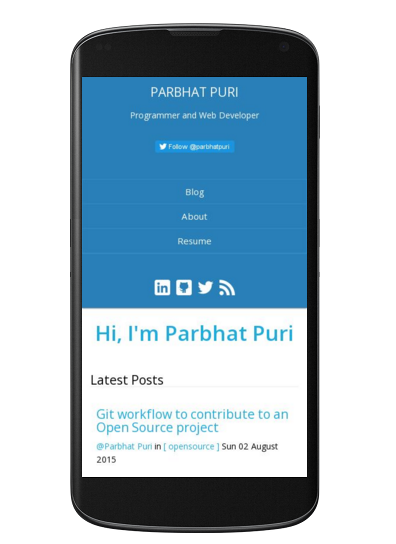
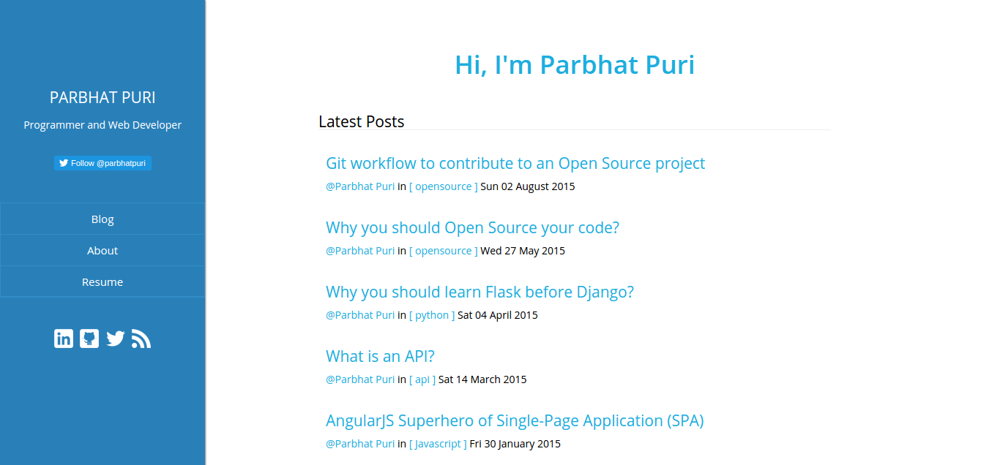
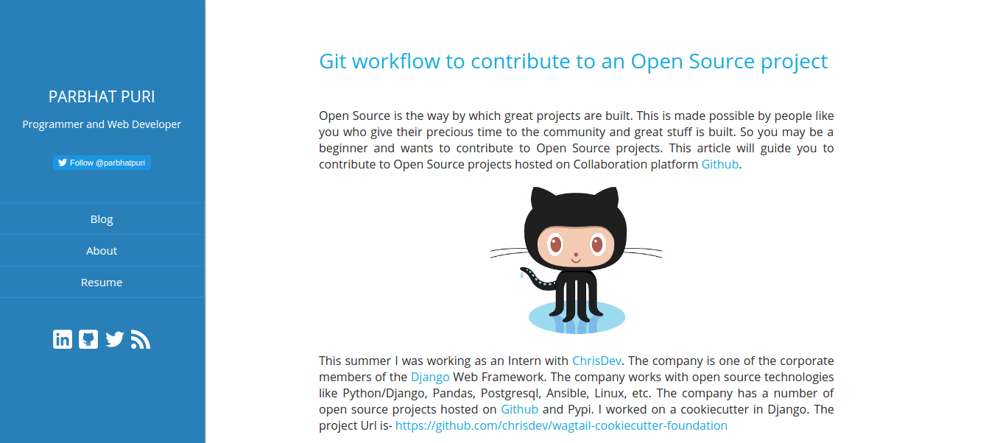

# Pelican-Blue

Responsive theme for [Pelican](http://blog.getpelican.com/) Static Site Generator, Powered by [Python](https://www.python.org/) Programming language.

## Demo

You can see the theme in action at https://parbhatpuri.com

### Screenshots








## Features

* Responsive (Mobile Friendly Test on [Google](https://www.google.com/webmasters/tools/mobile-friendly/?url=https%3A%2F%2Fparbhatpuri.com%2F))
* Fast (Load time tested on [Pingdom](http://tools.pingdom.com/fpt/#!/bT0Pry/https://parbhatpuri.com/): 540ms)
* Syntax highlighting for code blocks
* [Disqus](https://disqus.com/) for Comments
* Google Analytics
* RSS/ATOM feeds
* Easy to install

## Installation

You can install Pelican-Blue theme to your earlier Pelican project or create a new project from the Pelican [Quickstart](http://docs.getpelican.com/en/3.6.3/quickstart.html) guide.

* Clone the repository

```
$ git clone https://github.com/Parbhat/pelican-blue.git
```

* Create a `THEME` variable in your `pelicanconf.py` file and set its value to the location of pelican-blue theme.

```python
THEME = 'path-to-pelican-blue-theme'
```

If you have placed the `pelican-blue` theme inside your project's pelican-themes folder, change the `THEME` variable in `pelicanconf.py` to

```python
THEME = 'pelican-themes/pelican-blue'
```

* Add the following code to your `pelicanconf.py` file to display the social icons.

```python
SOCIAL = (('linkedin', 'https://www.linkedin.com/in/username'),
          ('github', 'https://github.com/username'),
          ('twitter', 'https://twitter.com/username'),
          )
```

* That's it! You have installed `pelican-blue`. To see the Theme in action run the devserver

```
make devserver
```

**Note:** If you are new to Pelican Static Site Generator, you can read the Pelican [Docs](http://docs.getpelican.com/en/3.6.3/) to learn the working of Pelican. You can also customize the theme after reading the documentation.

## Settings

### pelicanconf.py

Pelican-Blue theme use the following settings. You can add the following to your `pelicanconf.py` to get the site shown in the screenshots.

```python
SIDEBAR_DIGEST = 'Programmer and Web Developer'

FAVICON = 'url-to-favicon'

DISPLAY_PAGES_ON_MENU = True

TWITTER_USERNAME = 'twitter-user-name'

MENUITEMS = (('Blog', SITEURL),)
```

When developing locally, set the following variable:
```
SITEURL = 'http://localhost:8000'
```

### publishconf.py

When you are ready to publish your site add the following settings to `publishconf.py` file

```python
SITEURL = 'http://your-domain-address'

FEED_ALL_ATOM = 'feeds/all.atom.xml'
CATEGORY_FEED_ATOM = 'feeds/%s.atom.xml'

MENUITEMS = (('Blog', SITEURL),)

DISQUS_SITENAME = ""
GOOGLE_ANALYTICS = ""
```

For more information on publishing your site, read the publishing [docs](http://docs.getpelican.com/en/3.6.3/publish.html)

## Contributing

Your contributions are welcome to improve the `pelican-blue` theme.
